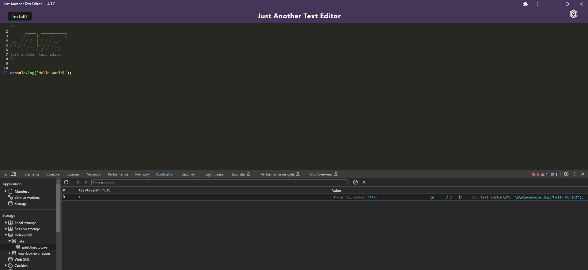

# pwaTextEditor

## Description

- I wanted to create a web application that can be downloaded and can create notes and code snippets online or offline.
- I wanted to expand my knowledge of progressive web applications and get familiar with webpack and service workers.
- This solves the problem of being limited to having internet access for the entire experience of the application.
- I learned how useful PWAs can be as well as how to trouble shoot persisting data in the browser using dev tools.

## Table of Contents 

- [Installation](#installation)
- [Usage](#usage)
- [License](#license)

## Installation

From the base code, npm install, npm run build, then npm run start or start:dev depending on needs. From the live site, click the install button to have the app locally. 

## Usage

This text editor can be used for plain text or code snippets with syntax highlighting. Internet is needed for initial load, then offline capabilities are available. Text written offline will need an internet connection to update elsewhere in the browser.  

[Heroku deployment](https://quiet-reaches-59584-957246460e74.herokuapp.com/)

## License

MIT License

Copyright (c) [year] [fullname]

Permission is hereby granted, free of charge, to any person obtaining a copy
of this software and associated documentation files (the "Software"), to deal
in the Software without restriction, including without limitation the rights
to use, copy, modify, merge, publish, distribute, sublicense, and/or sell
copies of the Software, and to permit persons to whom the Software is
furnished to do so, subject to the following conditions:

The above copyright notice and this permission notice shall be included in all
copies or substantial portions of the Software.

THE SOFTWARE IS PROVIDED "AS IS", WITHOUT WARRANTY OF ANY KIND, EXPRESS OR
IMPLIED, INCLUDING BUT NOT LIMITED TO THE WARRANTIES OF MERCHANTABILITY,
FITNESS FOR A PARTICULAR PURPOSE AND NONINFRINGEMENT. IN NO EVENT SHALL THE
AUTHORS OR COPYRIGHT HOLDERS BE LIABLE FOR ANY CLAIM, DAMAGES OR OTHER
LIABILITY, WHETHER IN AN ACTION OF CONTRACT, TORT OR OTHERWISE, ARISING FROM,
OUT OF OR IN CONNECTION WITH THE SOFTWARE OR THE USE OR OTHER DEALINGS IN THE
SOFTWARE.

## How to Contribute

Feel free to use this code. If you have any suggestions or would like to see more of my work, please check out my [Github](https://github.com/MWandall).

